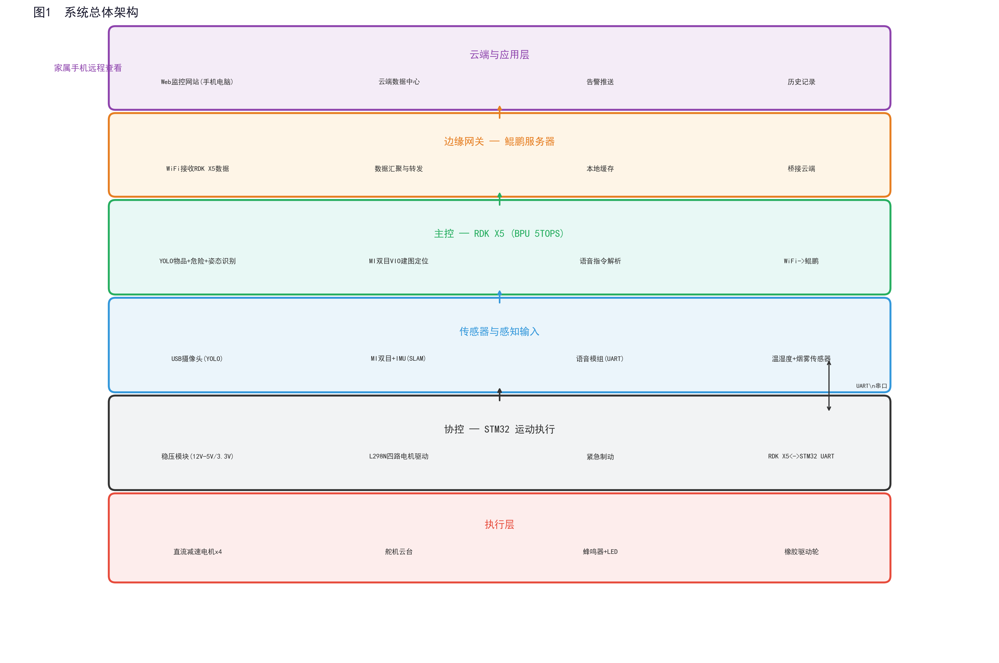

# 老人安全监护机器人

> 基于 RDK X5 + STM32 + 鲲鹏服务器的智能监护系统

## 系统架构



## 目录结构

```
elderly-care-robot/
├── rdkx5/                  # RDK X5 主控端
│   ├── yolo_live.py        # YOLO+HBM 实时检测 + MJPEG 推流
│   ├── push_stream.py      # 推流到鲲鹏服务器 + 跌倒告警
│   └── requirements.txt
├── stm32/                  # STM32 底盘控制
│   ├── src/                # 固件源码
│   ├── Makefile
│   ├── stm32f103.ld       # 链接脚本
│   ├── hardware-pin-spec.md
│   └── README.md
├── server/                 # 鲲鹏服务器端
│   ├── dual_server.py      # Flask 视频+告警服务器
│   ├── index.html          # Web 监控前端
│   ├── config.json         # 参数配置
│   ├── start_tunnel.sh     # Cloudflare 隧道
│   └── services/           # systemd 自启
├── .gitignore
└── README.md
```

## 硬件清单

| 设备 | 型号 | 用途 |
|------|------|------|
| 上位机 | RDK X5 | 主控制器 + AI 推理 |
| 摄像头 | USB Camera | 实时画面采集 |
| MCU | STM32F103RCT6 | 底盘运动控制 |
| 驱动板 | AT8236 四路H桥 | 电机驱动 |
| 电机 | 直流减速电机 ×4 | 四轮AWD底盘 |
| 服务器 | OrangePi 鲲鹏 Pro | 视频接收+公网穿透 |

## 快速开始

### RDK X5

```bash
# 实时检测 + 本地监控
python3 yolo_live.py
# 访问 http://<rdkx5-ip>:8390

# 推流到服务器 (公网监控)
python3 push_stream.py --cam1 0 --single
```

### STM32 固件

```bash
cd stm32
make          # 编译
make flash    # 烧录
```

### 服务器部署

见 [server/README.md](server/README.md)

## 告警类型

| 类型 | 触发条件 | 响应 |
|------|----------|------|
| 🔴 跌倒 | 人体宽高比 > 1.5 (横躺) | 立即推送告警 |
| 🟡 久坐 | 持续坐姿 > 阈值 | 推送提醒 |
| 🟢 正常 | 站立/行走 | 只推画面 |


